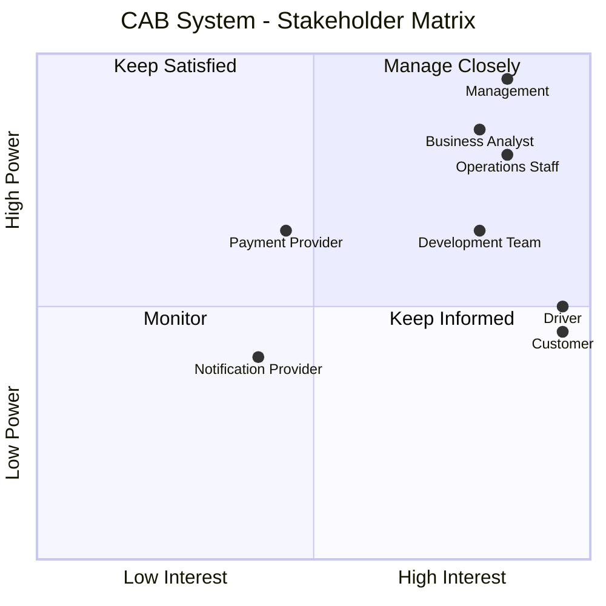
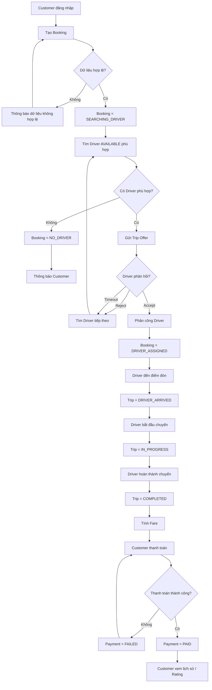
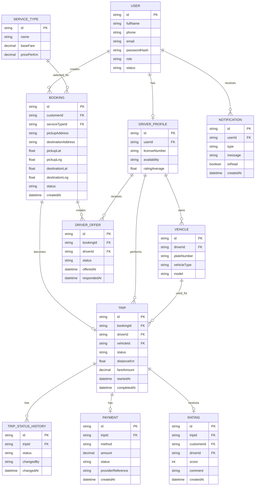
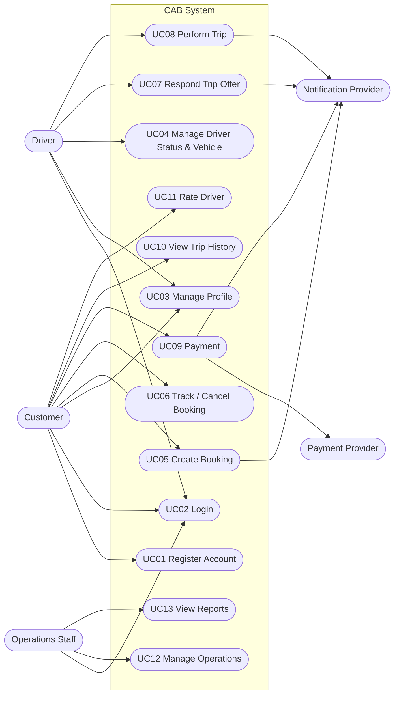

# CAB SYSTEM 

> **Dự án:** CAB System – Nền tảng đặt xe

---

# B1. Phân tích yêu cầu sơ khởi

## 1.1. Business Context

Công ty ABC cung cấp dịch vụ đặt xe trực tuyến.

Hiện tại khách hàng có thể đặt xe thông qua tổng đài hoặc một ứng dụng đơn giản. Tuy nhiên, nhiều công việc vẫn được xử lý thủ công, đặc biệt là việc tìm và phân công tài xế.

Công ty muốn xây dựng **CAB System** để quản lý toàn bộ quá trình:

**Khách hàng tạo yêu cầu → Tìm tài xế → Thực hiện chuyến → Tính cước → Thanh toán → Đánh giá sau chuyến.**

Hệ thống cần phục vụ ba nhóm người dùng chính:

* Customer.
* Driver.
* Operations Staff.

Ngoài ra hệ thống có tương tác với các dịch vụ bên ngoài như:

* Payment Provider.
* Notification Provider.

---

## 1.2. Business Problem

| Mã   | Vấn đề nghiệp vụ                                                                            |
| ---- | ------------------------------------------------------------------------------------------- |
| BP01 | Việc tìm và phân công tài xế còn phụ thuộc nhiều vào thao tác thủ công.                     |
| BP02 | Khách hàng khó biết trạng thái hiện tại của chuyến đi.                                      |
| BP03 | Chưa có cơ chế tự động tìm tài xế khác khi tài xế từ chối hoặc không phản hồi.              |
| BP04 | Thông tin khách hàng, tài xế, chuyến đi và thanh toán chưa được quản lý tập trung.          |
| BP05 | Bộ phận vận hành khó theo dõi các chuyến đang diễn ra khi quy mô hệ thống tăng.             |
| BP06 | Việc quản lý trạng thái hoạt động của tài xế còn hạn chế.                                   |
| BP07 | Hệ thống hiện tại khó mở rộng thêm phương thức thanh toán, thông báo hoặc loại dịch vụ mới. |
| BP08 | Lỗi của chức năng thanh toán hoặc thông báo có nguy cơ ảnh hưởng đến quá trình đặt xe.      |
| BP09 | Doanh nghiệp chưa có dữ liệu báo cáo tập trung để theo dõi hoạt động.                       |

---

## 1.3. Lý do cần xây dựng hệ thống mới

CAB System mới cần:

* Tự động hóa quá trình đặt và phân công xe.
* Cho phép theo dõi trạng thái chuyến.
* Quản lý tập trung khách hàng, tài xế, phương tiện và chuyến đi.
* Hỗ trợ tính cước và thanh toán.
* Hỗ trợ thông báo.
* Hỗ trợ nhân viên vận hành.
* Có dữ liệu lịch sử và báo cáo.
* Có khả năng mở rộng trong tương lai.
* Kiểm soát quyền truy cập và bảo vệ dữ liệu.

---

# B2. Stakeholder Analysis

## 2.1. Danh sách Stakeholder

| Stakeholder               | Vai trò                                                                                               |
| ------------------------- | ----------------------------------------------------------------------------------------------------- |
| **Customer**              | Đăng ký, đăng nhập, đặt xe, theo dõi chuyến, thanh toán, xem lịch sử và đánh giá tài xế.              |
| **Driver**                | Quản lý hồ sơ và phương tiện, thay đổi trạng thái hoạt động, nhận/từ chối chuyến và thực hiện chuyến. |
| **Operations Staff**      | Theo dõi khách hàng, tài xế, phương tiện, chuyến đi và giao dịch; hỗ trợ xử lý sự cố.                 |
| **Management**            | Đưa ra yêu cầu nghiệp vụ, xác nhận phạm vi và sử dụng báo cáo để theo dõi tình hình hoạt động.        |
| **Payment Provider**      | Xử lý các giao dịch thanh toán trực tuyến.                                                            |
| **Notification Provider** | Cung cấp kênh gửi thông báo cho Customer và Driver khi cần tích hợp bên ngoài.                        |
| **Business Analyst**      | Thu thập, phân tích, làm rõ và quản lý yêu cầu của hệ thống.                                          |
| **Development Team**      | Thiết kế, phát triển, kiểm thử và triển khai CAB System.                                              |

---

## 2.2. Stakeholder Matrix

Stakeholder Matrix được xây dựng dựa trên hai tiêu chí:

* **Interest:** mức độ quan tâm đến CAB System.
* **Power:** mức độ ảnh hưởng đến yêu cầu hoặc quyết định của dự án.



---

## 2.3. Phân tích Stakeholder Matrix

| Nhóm               | Stakeholder                                    | Ý nghĩa                                                                                                                          |
| ------------------ | ---------------------------------------------- | -------------------------------------------------------------------------------------------------------------------------------- |
| **Manage Closely** | Management, Operations Staff, Business Analyst | Có mức ảnh hưởng cao và quan tâm cao đến dự án. Cần trao đổi thường xuyên và xác nhận các yêu cầu quan trọng.                    |
| **Keep Satisfied** | Payment Provider                               | Có ảnh hưởng đến chức năng tích hợp nhưng không trực tiếp sử dụng phần lớn CAB System.                                           |
| **Keep Informed**  | Customer, Driver, Development Team             | Customer và Driver là người dùng trực tiếp; Development Team cần nắm rõ các yêu cầu để triển khai đúng hệ thống.                 |
| **Monitor**        | Notification Provider                          | Có mức ảnh hưởng thấp hơn trong phạm vi MVP vì hệ thống có thể sử dụng Notification nội bộ trước khi tích hợp dịch vụ bên ngoài. |

---

## 2.4. Nhận xét

Các Stakeholder cần được ưu tiên làm rõ yêu cầu nhất là:

* **Management:** xác nhận mục tiêu và phạm vi nghiệp vụ.
* **Operations Staff:** cung cấp yêu cầu quản lý và vận hành thực tế.
* **Customer:** cung cấp yêu cầu liên quan đến Booking, Trip, Payment và Rating.
* **Driver:** cung cấp yêu cầu liên quan đến Availability, Trip Offer và quá trình thực hiện Trip.
* **Business Analyst:** chịu trách nhiệm tổng hợp và làm rõ các yêu cầu còn TBD.

Payment Provider và Notification Provider là các Stakeholder bên ngoài, chủ yếu liên quan đến tích hợp dịch vụ.


---

# B3. Business Goals

| Mã       | Business Goal                             | Mô tả                                                                                              |
| -------- | ----------------------------------------- | -------------------------------------------------------------------------------------------------- |
| **BG01** | Giảm thời gian tìm tài xế                 | Tự động tìm và phân công tài xế phù hợp thay vì phụ thuộc vào thao tác thủ công.                   |
| **BG02** | Cải thiện khả năng theo dõi chuyến        | Khách hàng và nhân viên vận hành biết được trạng thái chuyến trong suốt vòng đời chuyến đi.        |
| **BG03** | Hỗ trợ tính cước và thanh toán            | Quản lý số tiền phải trả và hỗ trợ Cash/Online Payment.                                            |
| **BG04** | Quản lý dữ liệu tập trung và có kiểm soát | Quản lý tập trung tài khoản, tài xế, phương tiện và chuyến đi, đồng thời kiểm soát quyền truy cập. |
| **BG05** | Hỗ trợ mở rộng lâu dài                    | Cho phép bổ sung dịch vụ, phương thức thanh toán và kênh thông báo trong tương lai.                |
| **BG06** | Hỗ trợ vận hành và quản lý                | Cung cấp dữ liệu tra cứu, lịch sử và báo cáo để hỗ trợ hoạt động doanh nghiệp.                     |

---

# B4. Xác định Scope

## 4.1. In Scope – MVP

| Module                      | Nội dung                                                                |
| --------------------------- | ----------------------------------------------------------------------- |
| Account Management          | Đăng ký, đăng nhập và cập nhật thông tin cá nhân.                       |
| Driver & Vehicle Management | Quản lý hồ sơ tài xế, phương tiện và trạng thái hoạt động.              |
| Booking Management          | Tạo và hủy yêu cầu đặt xe.                                              |
| Driver Matching             | Tìm tài xế Available phù hợp và xử lý Reject/Timeout.                   |
| Trip Management             | Quản lý quá trình từ Driver Arrived đến Trip Completed.                 |
| Trip Tracking               | Cho Customer xem trạng thái chuyến hiện tại.                            |
| Fare Calculation            | Tính và lưu cước chuyến đi.                                             |
| Payment                     | Cash và Online Payment thông qua Mock/Sandbox Provider.                 |
| Notification                | Thông báo trong hệ thống về các sự kiện quan trọng.                     |
| Trip History                | Xem lịch sử các chuyến đã thực hiện.                                    |
| Rating                      | Customer đánh giá Driver sau chuyến.                                    |
| Operations Management       | Operations Staff tra cứu và theo dõi hoạt động.                         |
| Reporting                   | Báo cáo số chuyến, doanh thu, tỷ lệ hoàn thành/hủy và hoạt động tài xế. |
| Authorization               | Kiểm soát chức năng theo Role.                                          |

---

## 4.2. Out of Scope

Các nội dung sau không triển khai trong MVP:

* GPS Tracking thời gian thực.
* Điều hướng bản đồ như Google Maps/Grab.
* AI/Machine Learning để Matching Driver.
* Dynamic/Surge Pricing.
* Payment Gateway production.
* Lưu thông tin thẻ ngân hàng.
* Internet Banking thực.
* SMS/Push Notification thực.
* Chat/Call giữa Customer và Driver.
* Voucher/Promotion.
* Loyalty/Reward.
* Ví điện tử CAB.
* KYC tài xế nâng cao.
* Multi-city/Multi-country.
* Auto Scaling thực tế.
* High Availability production.
* Kiến trúc Microservices hoàn chỉnh.

MVP có thể tổ chức theo các module/service độc lập về mặt code nhưng **không bắt buộc triển khai Microservices**.

---

## 4.3. Các vấn đề cần làm rõ – TBD

| Mã    | Nội dung                                                       |
| ----- | -------------------------------------------------------------- |
| TBD01 | Công thức tính cước chính thức.                                |
| TBD02 | Các loại xe/dịch vụ chính thức.                                |
| TBD03 | Thời gian Driver được phép phản hồi Trip Offer.                |
| TBD04 | Tiêu chí ưu tiên Driver ngoài khoảng cách và loại phương tiện. |
| TBD05 | Chính sách hủy chuyến.                                         |
| TBD06 | Có tính phí khi hủy hay không.                                 |
| TBD07 | Cách xử lý khi Driver mất kết nối.                             |
| TBD08 | Thời gian lưu dữ liệu vị trí và dữ liệu giao dịch.             |

---

# B5. Business Requirements

| Mã       | Tên                           | Diễn giải                                                                |
| -------- | ----------------------------- | ------------------------------------------------------------------------ |
| **BR01** | Quản lý tài khoản             | Người dùng có thể đăng ký, đăng nhập và cập nhật thông tin cá nhân.      |
| **BR02** | Đặt chuyến                    | Customer cung cấp điểm đón, điểm đến và loại dịch vụ để tạo Booking.     |
| **BR03** | Tìm và phân công tài xế       | Hệ thống tự động tìm Driver phù hợp và xử lý trường hợp Reject/Timeout.  |
| **BR04** | Quản lý thực hiện chuyến      | Quản lý trạng thái chuyến từ lúc Driver đến điểm đón đến khi hoàn thành. |
| **BR05** | Quản lý tài xế và phương tiện | Lưu hồ sơ Driver, Vehicle và trạng thái hoạt động.                       |
| **BR06** | Theo dõi chuyến               | Customer có thể xem trạng thái hiện tại và Driver được phân công.        |
| **BR07** | Tính cước                     | Hệ thống tính và lưu số tiền của chuyến sau khi hoàn thành.              |
| **BR08** | Thanh toán                    | Hỗ trợ Cash và Online Payment.                                           |
| **BR09** | Thông báo                     | Customer và Driver nhận thông báo về các sự kiện quan trọng.             |
| **BR10** | Quản lý vận hành              | Operations Staff có thể tra cứu và theo dõi dữ liệu hoạt động.           |
| **BR11** | Lịch sử và đánh giá           | Customer xem lịch sử chuyến và đánh giá Driver sau khi hoàn thành.       |
| **BR12** | Báo cáo                       | Hệ thống thống kê các dữ liệu hoạt động cơ bản.                          |
| **BR13** | Phân quyền                    | Người dùng chỉ được sử dụng chức năng phù hợp với Role.                  |

---

# B6. Business Process

## 6.1. Quy trình nghiệp vụ chính

1. Customer đăng nhập.
2. Customer nhập điểm đón, điểm đến và loại dịch vụ.
3. Hệ thống kiểm tra thông tin.
4. Hệ thống tạo Booking.
5. Hệ thống tìm Driver đang `AVAILABLE`.
6. Hệ thống lọc Driver phù hợp.
7. Hệ thống gửi Trip Offer.
8. Driver Accept hoặc Reject.
9. Nếu Reject hoặc Timeout, hệ thống tiếp tục tìm Driver khác.
10. Nếu không còn Driver phù hợp, thông báo cho Customer.
11. Nếu Driver Accept, hệ thống phân công Driver.
12. Driver đến điểm đón.
13. Driver bắt đầu chuyến.
14. Driver hoàn thành chuyến.
15. Hệ thống tính cước.
16. Customer thanh toán.
17. Customer xem lịch sử và có thể đánh giá Driver.



---

# B7. Functional Requirements

> Functional Requirement chỉ mô tả **hệ thống cần làm gì**.
> API sẽ được thiết kế sau giai đoạn phân tích yêu cầu.

| Mã       | BR   | Functional Requirement                                                                              |
| -------- | ---- | --------------------------------------------------------------------------------------------------- |
| **FR01** | BR01 | Customer có thể đăng ký tài khoản.                                                                  |
| **FR02** | BR01 | Người dùng có thể đăng nhập.                                                                        |
| **FR03** | BR01 | Người dùng có thể xem và cập nhật thông tin cá nhân.                                                |
| **FR04** | BR02 | Customer có thể tạo Booking bằng điểm đón, điểm đến và loại dịch vụ.                                |
| **FR05** | BR02 | Hệ thống kiểm tra tính hợp lệ của dữ liệu Booking trước khi tạo.                                    |
| **FR06** | BR02 | Customer có thể hủy Booking khi thỏa điều kiện hủy.                                                 |
| **FR07** | BR03 | Hệ thống lấy danh sách Driver đang `AVAILABLE`.                                                     |
| **FR08** | BR03 | Hệ thống lọc và ưu tiên Driver theo vị trí và loại phương tiện.                                     |
| **FR09** | BR03 | Hệ thống tạo và gửi Trip Offer cho Driver phù hợp.                                                  |
| **FR10** | BR03 | Driver có thể Accept hoặc Reject Trip Offer.                                                        |
| **FR11** | BR03 | Khi Driver Reject hoặc hết thời gian phản hồi, hệ thống tiếp tục tìm Driver khác.                   |
| **FR12** | BR03 | Khi không còn Driver phù hợp, hệ thống kết thúc Matching và thông báo Customer.                     |
| **FR13** | BR04 | Driver có thể xác nhận đã đến điểm đón.                                                             |
| **FR14** | BR04 | Driver có thể bắt đầu chuyến.                                                                       |
| **FR15** | BR04 | Driver có thể hoàn thành chuyến.                                                                    |
| **FR16** | BR04 | Hệ thống kiểm tra thứ tự chuyển trạng thái Trip và lưu lịch sử thay đổi.                            |
| **FR17** | BR05 | Driver có thể thay đổi trạng thái `AVAILABLE` hoặc `OFFLINE`.                                       |
| **FR18** | BR05 | Driver có thể cập nhật hồ sơ và thông tin phương tiện.                                              |
| **FR19** | BR06 | Customer có thể xem trạng thái chuyến và thông tin Driver được phân công.                           |
| **FR20** | BR07 | Hệ thống tính Fare sau khi Trip hoàn thành.                                                         |
| **FR21** | BR07 | Hệ thống lưu Fare cuối cùng của Trip.                                                               |
| **FR22** | BR08 | Customer có thể chọn phương thức thanh toán.                                                        |
| **FR23** | BR08 | Hệ thống hỗ trợ ghi nhận thanh toán Cash.                                                           |
| **FR24** | BR08 | Hệ thống gửi Online Payment đến Payment Provider dạng Mock/Sandbox.                                 |
| **FR25** | BR08 | Khi Online Payment thất bại, hệ thống cho phép thực hiện lại.                                       |
| **FR26** | BR09 | Customer nhận thông báo về các sự kiện quan trọng của Booking, Trip và Payment.                     |
| **FR27** | BR09 | Driver nhận thông báo về Trip Offer và các thay đổi liên quan đến Trip.                             |
| **FR28** | BR10 | Operations Staff có thể tra cứu Customer, Driver, Vehicle, Trip và Payment.                         |
| **FR29** | BR10 | Operations Staff có thể theo dõi các Trip đang hoạt động và hỗ trợ xử lý sự cố trong phạm vi quyền. |
| **FR30** | BR11 | Customer có thể xem lịch sử các Trip của mình.                                                      |
| **FR31** | BR11 | Customer có thể đánh giá Driver sau khi Trip hoàn thành.                                            |
| **FR32** | BR12 | Hệ thống cung cấp báo cáo cơ bản về Trip, Revenue, Completion, Cancellation và Driver.              |
| **FR33** | BR13 | Hệ thống kiểm tra Role trước khi cho phép truy cập chức năng.                                       |

---

# B8. Business Rules & Business Exceptions

## 8.1. Business Rules

| Mã         | Business Rule                                                                                             |
| ---------- | --------------------------------------------------------------------------------------------------------- |
| **RULE01** | Người dùng phải đăng nhập trước khi sử dụng chức năng yêu cầu xác thực.                                   |
| **RULE02** | Chỉ Driver có trạng thái `AVAILABLE` mới được đưa vào quá trình Matching.                                 |
| **RULE03** | Vehicle của Driver phải phù hợp với loại dịch vụ Customer yêu cầu.                                        |
| **RULE04** | Driver đang thực hiện một Trip không được nhận Trip mới.                                                  |
| **RULE05** | Trip Offer chỉ có hiệu lực trong khoảng thời gian phản hồi quy định; giá trị cụ thể là TBD.               |
| **RULE06** | Khi Driver Reject hoặc Timeout, hệ thống phải tìm Driver tiếp theo mà Customer không cần tạo Booking mới. |
| **RULE07** | Booking chỉ chuyển sang `DRIVER_ASSIGNED` khi Driver Accept Trip Offer.                                   |
| **RULE08** | Trạng thái Trip phải chuyển theo đúng thứ tự nghiệp vụ.                                                   |
| **RULE09** | Chỉ Trip `COMPLETED` mới được tính Fare cuối cùng.                                                        |
| **RULE10** | Customer chỉ được Rating Trip đã `COMPLETED`.                                                             |
| **RULE11** | Một Trip chỉ được Customer đánh giá một lần.                                                              |
| **RULE12** | Online Payment phải được xử lý thông qua Payment Provider; CAB System không lưu dữ liệu thẻ nhạy cảm.     |
| **RULE13** | Việc hủy Booking phải tuân theo Cancellation Policy; chi tiết chính sách là TBD.                          |
| **RULE14** | Operations Staff chỉ được thực hiện các thao tác nằm trong quyền được cấp.                                |

---

## 8.2. Business Exceptions

| Mã       | Exception                                   | Cách xử lý                                                                                  |
| -------- | ------------------------------------------- | ------------------------------------------------------------------------------------------- |
| **EX01** | Không tìm được Driver                       | Booking chuyển sang `NO_DRIVER` và thông báo Customer.                                      |
| **EX02** | Driver Reject Trip Offer                    | Ghi nhận Reject và tìm Driver tiếp theo.                                                    |
| **EX03** | Driver không phản hồi                       | Sau thời gian quy định, Offer chuyển Timeout và hệ thống tìm Driver khác.                   |
| **EX04** | Driver không còn Available trước khi Accept | Driver bị loại khỏi Matching và hệ thống tiếp tục tìm.                                      |
| **EX05** | Booking thiếu hoặc sai dữ liệu              | Không tạo Booking và trả thông báo lỗi.                                                     |
| **EX06** | Customer hủy Booking                        | Booking chuyển sang `CANCELLED` nếu thỏa Cancellation Policy.                               |
| **EX07** | Driver cập nhật Trip sai thứ tự             | Hệ thống từ chối thay đổi trạng thái.                                                       |
| **EX08** | Online Payment thất bại                     | Payment chuyển `FAILED`, thông báo Customer và cho phép Retry.                              |
| **EX09** | Payment Provider không phản hồi             | Ghi nhận trạng thái lỗi/Pending theo chính sách nhưng không làm CAB System ngừng hoạt động. |
| **EX10** | Notification thất bại                       | Ghi log lỗi nhưng không rollback Booking/Trip/Payment.                                      |
| **EX11** | Người dùng không đủ quyền                   | Từ chối thao tác.                                                                           |
| **EX12** | Customer Rating Trip lần thứ hai            | Không cho phép tạo Rating mới.                                                              |

---

# B9. Data Model

## 9.1. Các Entity chính

* User.
* DriverProfile.
* Vehicle.
* ServiceType.
* Booking.
* DriverOffer.
* Trip.
* TripStatusHistory.
* Payment.
* Rating.
* Notification.

---

## 9.2. ERD



### Lý do cần `DRIVER_OFFER`

Ví dụ:

```text
Booking #001

Driver A → REJECTED
Driver B → TIMEOUT
Driver C → ACCEPTED
```

`DRIVER_OFFER` giúp hệ thống lưu được toàn bộ quá trình Matching thay vì chỉ biết Driver cuối cùng được phân công.

---

# B10. Non-Functional Requirements

| Mã        | Loại             | Yêu cầu                                                                                      |
| --------- | ---------------- | -------------------------------------------------------------------------------------------- |
| **NFR01** | Security         | Password phải được Hash, không lưu Plain Text.                                               |
| **NFR02** | Authentication   | Các chức năng yêu cầu tài khoản phải kiểm tra trạng thái đăng nhập.                          |
| **NFR03** | Authorization    | Hệ thống phải giới hạn quyền truy cập theo Role.                                             |
| **NFR04** | Privacy          | Dữ liệu cá nhân, phương tiện, vị trí và giao dịch phải được bảo vệ.                          |
| **NFR05** | Payment Security | Không lưu trực tiếp dữ liệu thẻ/tài khoản thanh toán nhạy cảm.                               |
| **NFR06** | Reliability      | Lỗi Notification không được làm Booking hoặc Trip thất bại.                                  |
| **NFR07** | Reliability      | Lỗi Payment Provider không được làm toàn bộ CAB System ngừng hoạt động.                      |
| **NFR08** | Maintainability  | Source Code phải được chia module/service rõ ràng để dễ bảo trì.                             |
| **NFR09** | Extensibility    | Thiết kế cần cho phép bổ sung Payment Provider, Notification Provider hoặc Service Type mới. |
| **NFR10** | Scalability      | Kiến trúc phải cho phép nâng cấp các thành phần khi số lượng người dùng tăng.                |
| **NFR11** | Logging          | Các lỗi và thao tác quan trọng phải được ghi Log.                                            |
| **NFR12** | Auditability     | Các thay đổi quan trọng của Trip cần có lịch sử để kiểm tra.                                 |
| **NFR13** | Interoperability | Các thành phần trao đổi dữ liệu theo giao diện API và định dạng thống nhất như JSON.         |

> Hiện tại chưa đặt giá trị cụ thể như **response time < 1 giây** vì khách hàng chưa cung cấp yêu cầu định lượng này.

### Liên hệ BG05

`BG05 – Hỗ trợ mở rộng lâu dài` chủ yếu được đáp ứng bởi:

* NFR08 – Maintainability.
* NFR09 – Extensibility.
* NFR10 – Scalability.
* NFR13 – Interoperability.

---

# B11. Use Case Diagram

## 11.1. Actors

### Primary Actors

* Customer.
* Driver.
* Operations Staff.

### Supporting Actors

* Payment Provider.
* Notification Provider.

---

## 11.2. Danh sách Use Case

| Mã       | Use Case                       | Actor                              |
| -------- | ------------------------------ | ---------------------------------- |
| **UC01** | Register Account               | Customer                           |
| **UC02** | Login                          | Customer, Driver, Operations Staff |
| **UC03** | Manage Profile                 | Customer, Driver                   |
| **UC04** | Manage Driver Status & Vehicle | Driver                             |
| **UC05** | Create Booking                 | Customer                           |
| **UC06** | Track / Cancel Booking         | Customer                           |
| **UC07** | Respond Trip Offer             | Driver                             |
| **UC08** | Perform Trip                   | Driver                             |
| **UC09** | Payment                        | Customer                           |
| **UC10** | View Trip History              | Customer                           |
| **UC11** | Rate Driver                    | Customer                           |
| **UC12** | Manage Operations              | Operations Staff                   |
| **UC13** | View Reports                   | Operations Staff                   |

---

## 11.3. Use Case Diagram



> Matching Driver, Calculate Fare và Send Notification là xử lý nội bộ hỗ trợ các Use Case chính nên không tách thành Use Case độc lập.

---

# B12. Use Case Specification

## UC01 – Register Account

* **Actor:** Customer
* **Precondition:** Customer chưa có tài khoản.
* **Postcondition:** Tài khoản mới được tạo.

### Basic Flow

1. Customer chọn Register.
2. Customer nhập thông tin.
3. Hệ thống kiểm tra dữ liệu.
4. Hệ thống tạo tài khoản.
5. Hệ thống thông báo đăng ký thành công.

### Exception

* Email/Phone đã tồn tại → từ chối đăng ký.
* Dữ liệu không hợp lệ → yêu cầu nhập lại.

---

## UC02 – Login

* **Actor:** Customer, Driver, Operations Staff
* **Precondition:** Có tài khoản hợp lệ.
* **Postcondition:** Người dùng được xác thực.

### Basic Flow

1. Người dùng nhập thông tin đăng nhập.
2. Hệ thống kiểm tra thông tin.
3. Hệ thống xác định Role.
4. Hệ thống cho phép truy cập.

### Exception

* Sai thông tin đăng nhập → thông báo thất bại.
* Tài khoản bị vô hiệu hóa → từ chối đăng nhập.

---

## UC03 – Manage Profile

* **Actor:** Customer, Driver
* **Precondition:** Đã Login.
* **Postcondition:** Hồ sơ được cập nhật.

### Basic Flow

1. Người dùng mở Profile.
2. Hệ thống hiển thị thông tin.
3. Người dùng chỉnh sửa.
4. Hệ thống Validation.
5. Hệ thống lưu thay đổi.

---

## UC04 – Manage Driver Status & Vehicle

* **Actor:** Driver
* **Precondition:** Driver đã Login.
* **Postcondition:** Trạng thái hoặc Vehicle được cập nhật.

### Basic Flow

1. Driver mở thông tin hoạt động.
2. Driver cập nhật Vehicle nếu cần.
3. Driver chọn `AVAILABLE` hoặc `OFFLINE`.
4. Hệ thống lưu dữ liệu.

### Exception

* Vehicle không hợp lệ → từ chối lưu.
* Driver đang thực hiện Trip → không cho chuyển sang trạng thái không phù hợp.

---

## UC05 – Create Booking

* **Actor:** Customer
* **Precondition:** Customer đã Login.
* **Postcondition:** Booking được tạo và bắt đầu Matching.

### Basic Flow

1. Customer nhập Pickup Location.
2. Customer nhập Destination.
3. Customer chọn Service Type.
4. Customer xác nhận.
5. Hệ thống Validation dữ liệu.
6. Hệ thống tạo Booking.
7. Hệ thống lấy Driver Available.
8. Hệ thống lọc Driver phù hợp.
9. Hệ thống gửi Trip Offer.
10. Driver Accept.
11. Hệ thống phân công Driver.
12. Customer nhận thông báo.

### Alternative Flow

**10a. Driver Reject**

1. Ghi nhận Reject.
2. Tìm Driver tiếp theo.

**10b. Driver Timeout**

1. Offer hết hạn.
2. Tìm Driver tiếp theo.

### Exception

**Không còn Driver phù hợp**

1. Booking chuyển `NO_DRIVER`.
2. Customer nhận thông báo.

---

## UC06 – Track / Cancel Booking

* **Actor:** Customer
* **Precondition:** Customer có Booking.
* **Postcondition:** Customer xem trạng thái hoặc Booking được Cancel.

### Basic Flow

1. Customer mở Booking hiện tại.
2. Hệ thống lấy thông tin Booking/Trip.
3. Hệ thống hiển thị trạng thái và Driver được phân công.

### Alternative Flow – Cancel

1. Customer chọn Cancel.
2. Hệ thống kiểm tra Cancellation Policy.
3. Nếu hợp lệ, Booking chuyển `CANCELLED`.

---

## UC07 – Respond Trip Offer

* **Actor:** Driver
* **Precondition:** Driver Available và có Trip Offer Pending.
* **Postcondition:** Offer được Accept/Reject/Timeout.

### Basic Flow

1. Driver nhận Trip Offer.
2. Driver xem thông tin chuyến.
3. Driver chọn Accept.
4. Hệ thống ghi nhận Offer Accepted.
5. Driver được phân công.

### Alternative Flow

**Driver Reject**

1. Driver chọn Reject.
2. Hệ thống ghi nhận.
3. Matching tiếp tục với Driver khác.

---

## UC08 – Perform Trip

* **Actor:** Driver
* **Precondition:** Driver đã Accept Trip.
* **Postcondition:** Trip `COMPLETED`.

### Basic Flow

1. Driver đến Pickup Location.
2. Driver chọn Arrived.
3. Hệ thống chuyển `DRIVER_ARRIVED`.
4. Driver đón Customer.
5. Driver chọn Start Trip.
6. Hệ thống chuyển `IN_PROGRESS`.
7. Driver đến Destination.
8. Driver chọn Complete.
9. Hệ thống chuyển `COMPLETED`.
10. Hệ thống tính Fare.
11. Hệ thống lưu Fare.

### Exception

* Driver yêu cầu chuyển trạng thái sai thứ tự → hệ thống từ chối.

---

## UC09 – Payment

* **Actor:** Customer
* **Supporting Actor:** Payment Provider
* **Precondition:** Trip Completed và có Fare.
* **Postcondition:** Payment được ghi nhận.

### Basic Flow – Cash

1. Customer chọn Cash.
2. Hệ thống tạo Payment.
3. Payment được xác nhận theo quy trình MVP.
4. Payment chuyển `PAID`.

### Basic Flow – Online

1. Customer chọn Online Payment.
2. Hệ thống tạo Payment.
3. CAB System gửi yêu cầu đến Payment Provider.
4. Payment Provider trả kết quả.
5. CAB System lưu trạng thái.

### Exception

* Online Payment thất bại → `FAILED`.
* Customer có thể Retry.

---

## UC10 – View Trip History

* **Actor:** Customer
* **Precondition:** Customer đã Login.
* **Postcondition:** Lịch sử Trip được hiển thị.

### Basic Flow

1. Customer mở Trip History.
2. Hệ thống lấy các Trip thuộc Customer.
3. Hiển thị danh sách.
4. Customer chọn một Trip để xem chi tiết.

---

## UC11 – Rate Driver

* **Actor:** Customer
* **Precondition:** Trip Completed và chưa được Rating.
* **Postcondition:** Rating được lưu.

### Basic Flow

1. Customer chọn Trip.
2. Chọn Rating.
3. Nhập từ 1–5 sao.
4. Có thể nhập Comment.
5. Submit.
6. Hệ thống lưu Rating.

### Exception

* Trip chưa Completed → không được Rating.
* Trip đã Rating → không cho Rating lần nữa.

---

## UC12 – Manage Operations

* **Actor:** Operations Staff
* **Precondition:** Staff đã Login và có quyền.
* **Postcondition:** Dữ liệu được tra cứu hoặc xử lý theo quyền.

### Basic Flow

1. Staff mở Operations Management.
2. Chọn Customer, Driver, Vehicle, Trip hoặc Payment.
3. Hệ thống hiển thị dữ liệu.
4. Staff tra cứu hoặc thực hiện thao tác được phép.
5. Hệ thống lưu thay đổi nếu có.

---

## UC13 – View Reports

* **Actor:** Operations Staff
* **Precondition:** Staff đã Login.
* **Postcondition:** Báo cáo được hiển thị.

### Basic Flow

1. Staff mở Reporting.
2. Hệ thống tổng hợp dữ liệu.
3. Hiển thị số lượng Trip.
4. Hiển thị Completed/Cancelled Trip.
5. Hiển thị Revenue.
6. Hiển thị dữ liệu hoạt động Driver.

---

# B13. Acceptance Criteria

| Mã       | FR   | Acceptance Criteria                                                                                                                                 |
| -------- | ---- | --------------------------------------------------------------------------------------------------------------------------------------------------- |
| **AC01** | FR01 | Given Customer nhập thông tin hợp lệ, When đăng ký, Then hệ thống tạo tài khoản thành công.                                                         |
| **AC02** | FR02 | Given thông tin đăng nhập chính xác, When Login, Then người dùng được xác thực thành công.                                                          |
| **AC03** | FR03 | Given User đã Login, When cập nhật Profile bằng dữ liệu hợp lệ, Then dữ liệu mới được lưu.                                                          |
| **AC04** | FR04 | Given Customer đã Login và cung cấp đầy đủ Pickup, Destination, Service Type, When xác nhận, Then Booking được tạo.                                 |
| **AC05** | FR05 | Given Booking thiếu dữ liệu bắt buộc, When Customer tạo Booking, Then hệ thống từ chối tạo.                                                         |
| **AC06** | FR06 | Given Booking đang ở trạng thái được phép hủy, When Customer Cancel, Then Booking chuyển `CANCELLED`.                                               |
| **AC07** | FR07 | Given Matching bắt đầu, Then chỉ Driver `AVAILABLE` được đưa vào danh sách.                                                                         |
| **AC08** | FR08 | Given nhiều Driver Available, Then hệ thống loại Driver sai Vehicle Type và ưu tiên Driver phù hợp theo khoảng cách.                                |
| **AC09** | FR09 | Given có Driver phù hợp, When Matching, Then hệ thống tạo Trip Offer cho Driver.                                                                    |
| **AC10** | FR10 | Given Driver có Offer Pending, When Accept/Reject, Then hệ thống lưu đúng kết quả.                                                                  |
| **AC11** | FR11 | Given Driver Reject hoặc Timeout, Then hệ thống tiếp tục thử Driver tiếp theo mà không tạo Booking mới.                                             |
| **AC12** | FR12 | Given không còn Driver phù hợp, Then Booking chuyển `NO_DRIVER` và Customer được thông báo.                                                         |
| **AC13** | FR13 | Given Driver đã được Assign, When chọn Arrived, Then Trip chuyển `DRIVER_ARRIVED`.                                                                  |
| **AC14** | FR14 | Given Trip `DRIVER_ARRIVED`, When Driver Start, Then Trip chuyển `IN_PROGRESS`.                                                                     |
| **AC15** | FR15 | Given Trip `IN_PROGRESS`, When Driver Complete, Then Trip chuyển `COMPLETED`.                                                                       |
| **AC16** | FR16 | Given Driver yêu cầu chuyển trạng thái sai thứ tự, Then hệ thống từ chối và trạng thái hiện tại không thay đổi.                                     |
| **AC17** | FR17 | Given Driver không thực hiện Trip, When thay đổi Availability hợp lệ, Then trạng thái mới được lưu.                                                 |
| **AC18** | FR18 | Given Driver đã Login, When cập nhật hồ sơ/Vehicle hợp lệ, Then dữ liệu được lưu.                                                                   |
| **AC19** | FR19 | Given Customer có Booking/Trip, When mở theo dõi, Then hệ thống hiển thị đúng trạng thái hiện tại và Driver đã Assign nếu có.                       |
| **AC20** | FR20 | Given Trip `COMPLETED`, When Fare được tính, Then kết quả tuân theo cấu hình giá đã xác nhận.                                                       |
| **AC21** | FR21 | Given Fare được tính thành công, Then Fare được lưu với Trip tương ứng.                                                                             |
| **AC22** | FR22 | Given Trip có Fare, When Customer chọn Payment Method, Then hệ thống ghi nhận phương thức được chọn.                                                |
| **AC23** | FR23 | Given Customer chọn Cash, When thanh toán được xác nhận, Then Payment chuyển `PAID`.                                                                |
| **AC24** | FR24 | Given Customer chọn Online, When Payment được tạo, Then CAB System gửi yêu cầu đến Mock/Sandbox Payment Provider.                                   |
| **AC25** | FR25 | Given Online Payment `FAILED`, When Customer Retry, Then hệ thống cho phép xử lý lại và lưu kết quả mới.                                            |
| **AC26** | FR26 | Given Booking/Trip/Payment có sự kiện quan trọng, Then Customer nhận Notification tương ứng.                                                        |
| **AC27** | FR27 | Given Driver có Trip Offer hoặc thay đổi liên quan Trip, Then Driver nhận Notification tương ứng.                                                   |
| **AC28** | FR28 | Given Operations Staff có quyền, When tra cứu Customer/Driver/Vehicle/Trip/Payment, Then hệ thống trả dữ liệu tương ứng.                            |
| **AC29** | FR29 | Given có Trip đang hoạt động, When Staff mở màn hình vận hành, Then hệ thống hiển thị trạng thái hiện tại của Trip.                                 |
| **AC30** | FR30 | Given Customer đã Login, When mở Trip History, Then chỉ các Trip thuộc Customer được hiển thị.                                                      |
| **AC31** | FR31 | Given Trip `COMPLETED` và chưa Rating, When Customer gửi Rating 1–5, Then Rating được lưu.                                                          |
| **AC32** | FR32 | Given Staff có quyền, When mở Reporting, Then hệ thống hiển thị các số liệu Trip, Revenue, Completion, Cancellation và Driver theo dữ liệu hiện có. |
| **AC33** | FR33 | Given User không có Role phù hợp, When truy cập chức năng hạn chế, Then hệ thống từ chối thao tác.                                                  |

---

# B14. Requirement Traceability Matrix – RTM

## 14.1. RTM

| BG         | BR   | FR   | UC                           | AC   |
| ---------- | ---- | ---- | ---------------------------- | ---- |
| BG04       | BR01 | FR01 | UC01                         | AC01 |
| BG04       | BR01 | FR02 | UC02                         | AC02 |
| BG04       | BR01 | FR03 | UC03                         | AC03 |
| BG01, BG02 | BR02 | FR04 | UC05                         | AC04 |
| BG01, BG02 | BR02 | FR05 | UC05                         | AC05 |
| BG02       | BR02 | FR06 | UC06                         | AC06 |
| BG01       | BR03 | FR07 | UC05                         | AC07 |
| BG01       | BR03 | FR08 | UC05                         | AC08 |
| BG01       | BR03 | FR09 | UC05                         | AC09 |
| BG01       | BR03 | FR10 | UC07                         | AC10 |
| BG01       | BR03 | FR11 | UC05, UC07                   | AC11 |
| BG01, BG02 | BR03 | FR12 | UC05                         | AC12 |
| BG02       | BR04 | FR13 | UC08                         | AC13 |
| BG02       | BR04 | FR14 | UC08                         | AC14 |
| BG02       | BR04 | FR15 | UC08                         | AC15 |
| BG02       | BR04 | FR16 | UC08                         | AC16 |
| BG01, BG04 | BR05 | FR17 | UC04                         | AC17 |
| BG04       | BR05 | FR18 | UC03, UC04                   | AC18 |
| BG02       | BR06 | FR19 | UC06                         | AC19 |
| BG03       | BR07 | FR20 | UC08                         | AC20 |
| BG03       | BR07 | FR21 | UC08                         | AC21 |
| BG03       | BR08 | FR22 | UC09                         | AC22 |
| BG03       | BR08 | FR23 | UC09                         | AC23 |
| BG03, BG05 | BR08 | FR24 | UC09                         | AC24 |
| BG03       | BR08 | FR25 | UC09                         | AC25 |
| BG02       | BR09 | FR26 | UC05, UC06, UC08, UC09       | AC26 |
| BG02       | BR09 | FR27 | UC05, UC07, UC08             | AC27 |
| BG04, BG06 | BR10 | FR28 | UC12                         | AC28 |
| BG02, BG06 | BR10 | FR29 | UC12                         | AC29 |
| BG02, BG06 | BR11 | FR30 | UC10                         | AC30 |
| BG02       | BR11 | FR31 | UC11                         | AC31 |
| BG06       | BR12 | FR32 | UC13                         | AC32 |
| BG04       | BR13 | FR33 | UC02, UC04, UC06, UC12, UC13 | AC33 |

---

## 14.2. BG05 và NFR

`BG05 – Hỗ trợ mở rộng lâu dài` là mục tiêu chủ yếu mang tính phi chức năng.

Do bảng RTM theo yêu cầu hiện tại chỉ gồm:

```text
BG → BR → FR → UC → AC
```

nên phần mở rộng hệ thống còn được truy xuất thông qua:

```text
BG05
 ↓
NFR08 Maintainability
NFR09 Extensibility
NFR10 Scalability
NFR13 Interoperability
```

Không nên tạo Functional Requirement giả chỉ để ép BG05 vào RTM.

---

# Tổng kết

Chuỗi phân tích yêu cầu của CAB System:

```text
Yêu cầu khách hàng
        ↓
B1. Business Context / Business Problem
        ↓
B2. Stakeholder
        ↓
B3. Business Goal
        ↓
B4. Scope
        ↓
B5. Business Requirement
        ↓
B6. Business Process
        ↓
B7. Functional Requirement
        ↓
B8. Business Rule / Exception
        ↓
B9. Data Model
        ↓
B10. Non-Functional Requirement
        ↓
B11. Use Case Diagram
        ↓
B12. Use Case Specification
        ↓
B13. Acceptance Criteria
        ↓
B14. Requirement Traceability Matrix
        ↓
Test Case
        ↓
API / Database Design
        ↓
Implementation
```

## Phạm vi cuối cùng

| Thành phần                  | Số lượng |
| --------------------------- | -------: |
| Business Problems           |        9 |
| Stakeholders                |        8 |
| Business Goals              |        6 |
| Business Requirements       |       13 |
| Functional Requirements     |       33 |
| Business Rules              |       14 |
| Business Exceptions         |       12 |
| Main Entities               |       11 |
| Non-Functional Requirements |       13 |
| Use Cases                   |       13 |
| Acceptance Criteria         |       33 |

## Luồng MVP quan trọng nhất

```text
Register / Login
        ↓
Create Booking
        ↓
Find Driver
        ↓
Driver Accept
        ↓
Driver Arrived
        ↓
Start Trip
        ↓
Complete Trip
        ↓
Calculate Fare
        ↓
Payment
        ↓
Trip History / Rating
```

Nguyên tắc xuyên suốt của dự án:

> **Mỗi chức năng được giữ trong Scope phải có khả năng đi hết chuỗi từ Business Requirement → Functional Requirement → Use Case → Acceptance Criteria → Test Case → Implementation.**

