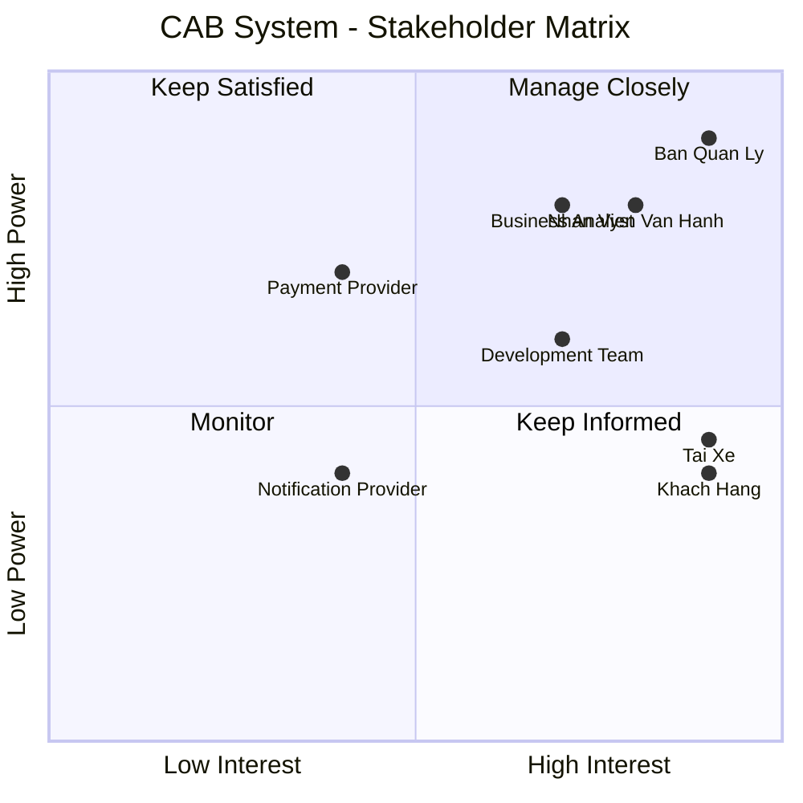
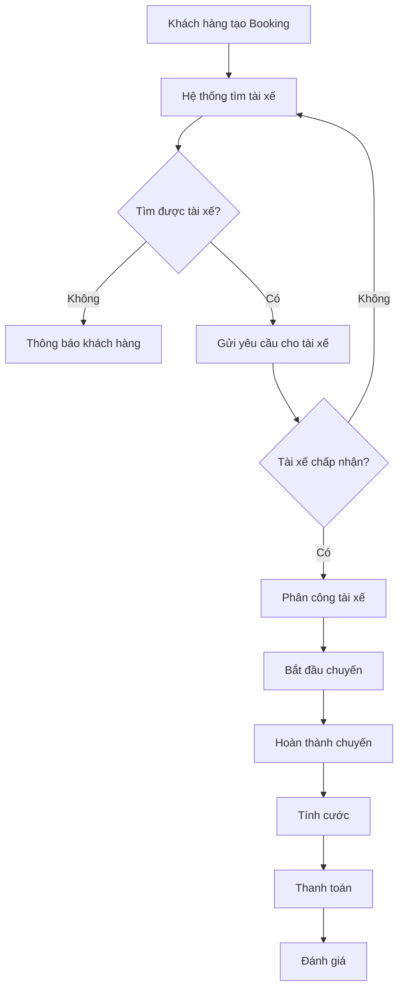
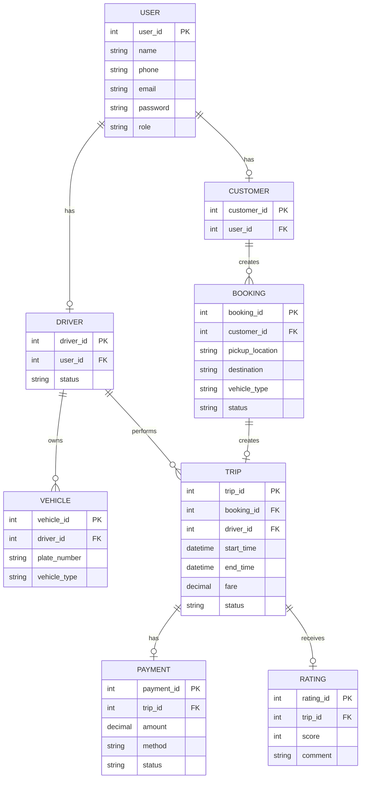
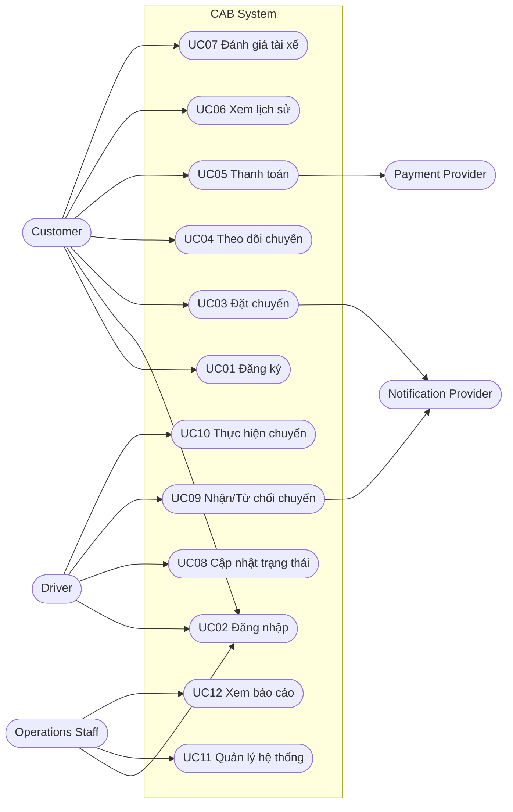

# CAB SYSTEM - SRS

## B1. Phân tích yêu cầu sơ khởi

### Yêu cầu

- Hiểu Business Context của hệ thống.
- Xác định Business Problem.
- Tại sao hệ thống hiện tại cần được thay thế.
- Xác định những bên tham gia vào hệ thống.

### Bài làm

#### Business Context

Công ty ABC cung cấp dịch vụ đặt xe trực tuyến.

Hiện tại khách hàng có thể đặt xe thông qua tổng đài hoặc ứng dụng đặt xe đơn giản. Tuy nhiên, nhiều công việc vẫn còn xử lý thủ công, đặc biệt là việc tìm và phân công tài xế.

Công ty muốn xây dựng **CAB System** để quản lý quá trình đặt xe từ lúc khách hàng tạo yêu cầu, tìm tài xế, thực hiện chuyến đi, tính cước, thanh toán và đánh giá sau chuyến.

#### Business Problem

| Mã | Vấn đề |
|---|---|
| BP01 | Việc tìm và phân công tài xế còn phụ thuộc nhiều vào thao tác thủ công. |
| BP02 | Khách hàng khó theo dõi trạng thái chuyến đi. |
| BP03 | Thông tin chuyến đi và thanh toán chưa được quản lý tập trung. |
| BP04 | Bộ phận vận hành khó quản lý khi số lượng khách hàng và tài xế tăng. |
| BP05 | Hệ thống hiện tại khó mở rộng thêm chức năng. |

Vì vậy cần xây dựng CAB System mới để tự động hóa quá trình đặt xe, dễ quản lý hơn và có thể mở rộng trong tương lai.

Các bên chính liên quan đến hệ thống:

- Khách hàng.
- Tài xế.
- Nhân viên vận hành.
- Ban quản lý công ty.
- Đơn vị thanh toán.
- Đơn vị cung cấp dịch vụ thông báo.
- Nhóm phát triển hệ thống.

---

# B2. Xác định Stakeholder

### Yêu cầu

- Xác định các Stakeholder.
- Lập bảng tên Stakeholder và vai trò.
- Vẽ Stakeholder Matrix bằng Mermaid.

### Bài làm

| Stakeholder | Vai trò |
|---|---|
| Khách hàng | Đặt xe, theo dõi chuyến, thanh toán, xem lịch sử và đánh giá tài xế. |
| Tài xế | Nhận chuyến, thực hiện chuyến đi, cập nhật trạng thái hoạt động. |
| Nhân viên vận hành | Theo dõi và quản lý khách hàng, tài xế, phương tiện và chuyến đi. |
| Ban quản lý | Đưa ra yêu cầu và theo dõi hoạt động của hệ thống. |
| Payment Provider | Xử lý thanh toán trực tuyến. |
| Notification Provider | Gửi thông báo cho khách hàng và tài xế. |
| Business Analyst | Phân tích và làm rõ yêu cầu. |
| Development Team | Phát triển và kiểm thử hệ thống. |

#### Stakeholder Matrix



---

# B3. Business Goal

### Yêu cầu

Từ các vấn đề nghiệp vụ, xác định những mục tiêu mà CAB System cần đạt được.

### Bài làm

| Mã | Business Goal | Mô tả |
|---|---|---|
| BG01 | Giảm thời gian tìm tài xế | Tự động tìm tài xế phù hợp thay vì phân công thủ công. |
| BG02 | Theo dõi chuyến đi tốt hơn | Khách hàng và nhân viên vận hành có thể biết trạng thái chuyến. |
| BG03 | Hỗ trợ thanh toán | Hỗ trợ thanh toán tiền mặt và thanh toán trực tuyến. |
| BG04 | Quản lý tập trung | Quản lý khách hàng, tài xế, phương tiện và chuyến đi trên cùng hệ thống. |
| BG05 | Hỗ trợ mở rộng | Hệ thống có thể phát triển thêm chức năng khi nhu cầu tăng. |
| BG06 | Hỗ trợ quản lý | Có dữ liệu và báo cáo để theo dõi hoạt động của hệ thống. |

---

# B4. Xác định Scope

### Yêu cầu

Xác định những chức năng nằm trong phạm vi và ngoài phạm vi của CAB System.

### Bài làm

## In Scope

| Module | Nội dung |
|---|---|
| Account Management | Đăng ký, đăng nhập và quản lý tài khoản. |
| Customer Management | Quản lý khách hàng. |
| Driver Management | Quản lý tài xế và trạng thái tài xế. |
| Vehicle Management | Quản lý phương tiện của tài xế. |
| Booking Management | Tạo và quản lý yêu cầu đặt xe. |
| Driver Matching | Tìm tài xế phù hợp. |
| Trip Management | Quản lý quá trình thực hiện chuyến đi. |
| Fare Calculation | Tính tiền chuyến đi. |
| Payment | Thanh toán tiền mặt hoặc trực tuyến. |
| Notification | Gửi thông báo cho khách hàng và tài xế. |
| Trip History | Xem lịch sử chuyến đi. |
| Rating | Đánh giá tài xế. |
| Reporting | Báo cáo hoạt động. |

## Out of Scope

- Không tự xây dựng Payment Gateway.
- Không lưu trực tiếp thông tin thẻ ngân hàng của khách hàng.
- Chưa xét các loại dịch vụ đặt xe mới ngoài yêu cầu hiện tại.
- Chưa bắt buộc sử dụng Microservice ở giai đoạn này.

## Các vấn đề cần làm rõ thêm

- Công thức tính cước cụ thể.
- Thời gian tài xế được phép chờ để nhận chuyến.
- Quy định hủy chuyến.
- Tiêu chí ưu tiên tài xế khi có nhiều tài xế phù hợp.

Các nội dung này tạm thời để **TBD (To Be Determined)**.

---

# B5. Business Requirements

### Yêu cầu

Chuyển các yêu cầu nghiệp vụ thành Business Requirement.

Mỗi BR gồm:

- Mã.
- Tên.
- Diễn giải.

### Bài làm

| Mã | Tên | Diễn giải |
|---|---|---|
| BR01 | Quản lý tài khoản | Người dùng có thể đăng ký, đăng nhập và cập nhật tài khoản. |
| BR02 | Đặt chuyến | Khách hàng nhập điểm đón, điểm đến và loại xe để tạo chuyến. |
| BR03 | Tìm tài xế | Hệ thống tự động tìm tài xế phù hợp. |
| BR04 | Quản lý chuyến đi | Quản lý trạng thái chuyến từ lúc tạo đến khi hoàn thành hoặc hủy. |
| BR05 | Quản lý tài xế và phương tiện | Lưu thông tin tài xế, phương tiện và trạng thái hoạt động. |
| BR06 | Theo dõi chuyến | Khách hàng có thể xem trạng thái chuyến hiện tại. |
| BR07 | Tính cước | Hệ thống tính số tiền cần thanh toán sau chuyến. |
| BR08 | Thanh toán | Hỗ trợ tiền mặt và thanh toán trực tuyến. |
| BR09 | Thông báo | Gửi thông báo về đặt xe, tài xế, chuyến đi và thanh toán. |
| BR10 | Quản lý vận hành | Nhân viên có thể quản lý khách hàng, tài xế và chuyến đi. |
| BR11 | Lịch sử và đánh giá | Khách hàng xem lịch sử và đánh giá tài xế. |
| BR12 | Báo cáo | Thống kê chuyến đi, doanh thu và hoạt động tài xế. |
| BR13 | Phân quyền | Người dùng chỉ được sử dụng chức năng đúng với quyền của mình. |

---

# B6. Business Process

### Yêu cầu

Xây dựng quy trình nghiệp vụ chính của CAB System.

### Bài làm

Quy trình chính của hệ thống:

1. Khách hàng nhập điểm đón.
2. Khách hàng nhập điểm đến.
3. Khách hàng chọn loại xe.
4. Hệ thống tạo Booking.
5. Hệ thống tìm tài xế đang Available.
6. Gửi yêu cầu chuyến cho tài xế.
7. Nếu tài xế từ chối thì tiếp tục tìm tài xế khác.
8. Nếu tài xế chấp nhận thì phân công tài xế.
9. Tài xế đến đón khách.
10. Bắt đầu chuyến đi.
11. Tài xế hoàn thành chuyến.
12. Hệ thống tính cước.
13. Khách hàng thanh toán.
14. Khách hàng có thể đánh giá tài xế.



---

# B7. Functional Requirements

### Yêu cầu

Phân rã các Business Requirement thành các Functional Requirement cụ thể.

### Bài làm

| Mã | BR liên quan | Functional Requirement |
|---|---|---|
| FR01 | BR01 | Khách hàng có thể đăng ký tài khoản. |
| FR02 | BR01 | Người dùng có thể đăng nhập. |
| FR03 | BR01 | Người dùng có thể cập nhật thông tin cá nhân. |
| FR04 | BR02 | Khách hàng có thể nhập điểm đón. |
| FR05 | BR02 | Khách hàng có thể nhập điểm đến. |
| FR06 | BR02 | Khách hàng có thể chọn loại xe. |
| FR07 | BR02 | Hệ thống tạo Booking. |
| FR08 | BR03 | Hệ thống lấy danh sách tài xế Available. |
| FR09 | BR03 | Hệ thống tìm tài xế phù hợp với vị trí và loại xe. |
| FR10 | BR03 | Hệ thống gửi yêu cầu chuyến cho tài xế. |
| FR11 | BR03 | Tài xế có thể chấp nhận hoặc từ chối chuyến. |
| FR12 | BR03 | Nếu tài xế từ chối, hệ thống tìm tài xế khác. |
| FR13 | BR04 | Tài xế có thể bắt đầu chuyến. |
| FR14 | BR04 | Tài xế có thể hoàn thành chuyến. |
| FR15 | BR05 | Tài xế có thể cập nhật trạng thái Available/Unavailable. |
| FR16 | BR05 | Hệ thống lưu thông tin phương tiện của tài xế. |
| FR17 | BR06 | Khách hàng có thể xem trạng thái chuyến. |
| FR18 | BR07 | Hệ thống tính cước sau khi chuyến hoàn thành. |
| FR19 | BR08 | Khách hàng có thể chọn phương thức thanh toán. |
| FR20 | BR08 | Hệ thống xử lý thanh toán trực tuyến thông qua Payment Provider. |
| FR21 | BR09 | Hệ thống gửi thông báo khi có thay đổi quan trọng của chuyến. |
| FR22 | BR10 | Nhân viên có thể quản lý khách hàng. |
| FR23 | BR10 | Nhân viên có thể quản lý tài xế. |
| FR24 | BR10 | Nhân viên có thể theo dõi các chuyến đi. |
| FR25 | BR11 | Khách hàng có thể xem lịch sử chuyến đi. |
| FR26 | BR11 | Khách hàng có thể đánh giá tài xế sau chuyến. |
| FR27 | BR12 | Hệ thống có thể thống kê số chuyến và doanh thu. |
| FR28 | BR13 | Hệ thống kiểm tra quyền người dùng trước khi cho sử dụng chức năng quản trị. |

> API chưa được thiết kế ở bước này. Functional Requirement chỉ mô tả hệ thống cần làm gì.

---

# B8. Business Rule và Exception

### Yêu cầu

- Xác định các luật nghiệp vụ.
- Xác định các trường hợp ngoại lệ và cách xử lý.

### Bài làm

## Business Rule

| Mã | Rule |
|---|---|
| RULE01 | Chỉ tài xế đang ở trạng thái Available mới được nhận yêu cầu chuyến. |
| RULE02 | Loại phương tiện của tài xế phải phù hợp với loại xe khách hàng chọn. |
| RULE03 | Tài xế đang thực hiện chuyến không được nhận chuyến mới. |
| RULE04 | Chỉ chuyến đã hoàn thành mới được tính cước cuối cùng. |
| RULE05 | Khách hàng chỉ được đánh giá tài xế sau khi chuyến hoàn thành. |
| RULE06 | Thanh toán trực tuyến được xử lý thông qua Payment Provider. |

## Exception

| Mã | Trường hợp | Cách xử lý |
|---|---|---|
| EX01 | Không tìm được tài xế | Thông báo cho khách hàng. |
| EX02 | Tài xế từ chối chuyến | Tiếp tục tìm tài xế khác. |
| EX03 | Tài xế không phản hồi | Chờ theo thời gian quy định rồi tìm tài xế khác. Thời gian cụ thể TBD. |
| EX04 | Thanh toán trực tuyến thất bại | Thông báo và cho phép khách hàng thử lại. |
| EX05 | Dữ liệu Booking không hợp lệ | Không tạo Booking và yêu cầu nhập lại. |
| EX06 | Notification bị lỗi | Ghi nhận lỗi nhưng không làm hủy chuyến. |

---

# B9. Data Model

### Yêu cầu

Xác định các thực thể chính và vẽ ERD.

### Bài làm

Các thực thể chính gồm:

- User
- Customer
- Driver
- Vehicle
- Booking
- Trip
- Payment
- Rating



---

# B10. Non-Functional Requirements

### Yêu cầu

Xác định các yêu cầu phi chức năng của hệ thống.

### Bài làm

| Mã | Loại | Yêu cầu |
|---|---|---|
| NFR01 | Security | Mật khẩu không được lưu dưới dạng văn bản thuần. |
| NFR02 | Security | Người dùng phải đăng nhập trước khi sử dụng các chức năng yêu cầu xác thực. |
| NFR03 | Authorization | Người dùng chỉ được truy cập chức năng theo quyền. |
| NFR04 | Reliability | Lỗi Notification không được làm toàn bộ quá trình đặt xe thất bại. |
| NFR05 | Reliability | Lỗi Payment Provider không được làm toàn bộ hệ thống ngừng hoạt động. |
| NFR06 | Scalability | Hệ thống có khả năng mở rộng khi số người dùng và chuyến đi tăng. |
| NFR07 | Maintainability | Code và các module cần được tổ chức rõ ràng để dễ bảo trì. |
| NFR08 | Logging | Các lỗi quan trọng cần được lưu log. |

Hiện tại chưa đặt yêu cầu cụ thể như response time dưới 1 giây vì đề bài chưa cung cấp.

---

# B11. Use Case Diagram

### Yêu cầu

- Xác định Actor.
- Xác định các Use Case.
- Vẽ Use Case Diagram.

### Bài làm

Các Actor trực tiếp sử dụng hệ thống:

- Customer.
- Driver.
- Operations Staff.

Actor bên ngoài:

- Payment Provider.
- Notification Provider.

Các Use Case chính:

| Mã | Use Case | Actor |
|---|---|---|
| UC01 | Đăng ký tài khoản | Customer |
| UC02 | Đăng nhập | Customer, Driver, Operations Staff |
| UC03 | Đặt chuyến | Customer |
| UC04 | Theo dõi chuyến | Customer |
| UC05 | Thanh toán | Customer |
| UC06 | Xem lịch sử chuyến | Customer |
| UC07 | Đánh giá tài xế | Customer |
| UC08 | Cập nhật trạng thái | Driver |
| UC09 | Nhận/Từ chối chuyến | Driver |
| UC10 | Thực hiện chuyến | Driver |
| UC11 | Quản lý hệ thống | Operations Staff |
| UC12 | Xem báo cáo | Operations Staff |



---

# B12. Use Case Specification

### Yêu cầu

Viết đặc tả cho các Use Case đã xác định ở B11.

### Bài làm

## UC01 - Đăng ký tài khoản

- **Actor:** Customer
- **Tiền điều kiện:** Chưa có tài khoản.
- **Hậu điều kiện:** Tài khoản được tạo.

### Basic Flow

1. Customer chọn đăng ký.
2. Customer nhập thông tin.
3. Hệ thống kiểm tra thông tin.
4. Hệ thống tạo tài khoản.
5. Thông báo đăng ký thành công.

### Exception

- Email hoặc số điện thoại đã tồn tại → thông báo cho Customer.

---

## UC02 - Đăng nhập

- **Actor:** Customer, Driver, Operations Staff
- **Tiền điều kiện:** Có tài khoản.
- **Hậu điều kiện:** Đăng nhập thành công.

### Basic Flow

1. Người dùng nhập tài khoản và mật khẩu.
2. Hệ thống kiểm tra thông tin.
3. Nếu đúng, hệ thống cho phép đăng nhập.
4. Hệ thống xác định quyền theo Role.

### Exception

- Sai tài khoản hoặc mật khẩu → thông báo đăng nhập thất bại.

---

## UC03 - Đặt chuyến

- **Actor:** Customer
- **Tiền điều kiện:** Customer đã đăng nhập.
- **Hậu điều kiện:** Booking được tạo và bắt đầu tìm tài xế.

### Basic Flow

1. Customer chọn đặt xe.
2. Nhập điểm đón.
3. Nhập điểm đến.
4. Chọn loại xe.
5. Customer xác nhận.
6. Hệ thống tạo Booking.
7. Hệ thống tìm tài xế.
8. Gửi yêu cầu cho tài xế.
9. Tài xế chấp nhận.
10. Hệ thống thông báo cho Customer.

### Alternative Flow

**5a. Customer chọn hủy**

- Không tạo Booking.

### Exception Flow

**7a. Không tìm được tài xế**

- Hệ thống thông báo Customer.

**9a. Tài xế từ chối**

- Hệ thống tiếp tục tìm tài xế khác.

---

## UC04 - Theo dõi chuyến

- **Actor:** Customer
- **Tiền điều kiện:** Có Booking đang hoạt động.
- **Hậu điều kiện:** Customer xem được trạng thái chuyến.

### Basic Flow

1. Customer mở chuyến hiện tại.
2. Hệ thống lấy trạng thái chuyến.
3. Hiển thị thông tin Driver và trạng thái Trip.

---

## UC05 - Thanh toán

- **Actor:** Customer
- **Actor phụ:** Payment Provider
- **Tiền điều kiện:** Trip đã hoàn thành.
- **Hậu điều kiện:** Payment được ghi nhận.

### Basic Flow

1. Hệ thống hiển thị số tiền.
2. Customer chọn phương thức thanh toán.
3. Nếu thanh toán trực tuyến, hệ thống gửi yêu cầu cho Payment Provider.
4. Payment Provider trả kết quả.
5. Hệ thống lưu trạng thái thanh toán.

### Exception Flow

- Thanh toán thất bại → thông báo Customer và cho phép thử lại.

---

## UC06 - Xem lịch sử chuyến

- **Actor:** Customer
- **Tiền điều kiện:** Customer đã đăng nhập.
- **Hậu điều kiện:** Danh sách chuyến được hiển thị.

### Basic Flow

1. Customer chọn lịch sử chuyến.
2. Hệ thống lấy danh sách chuyến.
3. Hiển thị kết quả.
4. Customer có thể chọn một chuyến để xem chi tiết.

---

## UC07 - Đánh giá tài xế

- **Actor:** Customer
- **Tiền điều kiện:** Trip đã hoàn thành.
- **Hậu điều kiện:** Rating được lưu.

### Basic Flow

1. Customer chọn chuyến đã hoàn thành.
2. Chọn đánh giá.
3. Nhập số sao và nhận xét.
4. Hệ thống lưu đánh giá.

### Exception Flow

- Trip chưa hoàn thành → không cho phép đánh giá.

---

## UC08 - Cập nhật trạng thái tài xế

- **Actor:** Driver
- **Tiền điều kiện:** Driver đã đăng nhập.
- **Hậu điều kiện:** Trạng thái mới được lưu.

### Basic Flow

1. Driver chọn trạng thái Available hoặc Unavailable.
2. Hệ thống cập nhật trạng thái.
3. Hệ thống lưu vị trí hiện tại của Driver.

---

## UC09 - Nhận/Từ chối chuyến

- **Actor:** Driver
- **Tiền điều kiện:** Driver đang Available và nhận được yêu cầu.
- **Hậu điều kiện:** Chuyến được nhận hoặc chuyển sang Driver khác.

### Basic Flow

1. Driver nhận yêu cầu chuyến.
2. Driver xem thông tin.
3. Driver chọn Accept.
4. Hệ thống phân công Driver cho Booking.
5. Thông báo cho Customer.

### Alternative Flow

**3a. Driver chọn Reject**

1. Hệ thống ghi nhận từ chối.
2. Tiếp tục tìm Driver khác.

---

## UC10 - Thực hiện chuyến

- **Actor:** Driver
- **Tiền điều kiện:** Driver đã nhận chuyến.
- **Hậu điều kiện:** Trip được hoàn thành.

### Basic Flow

1. Driver đến điểm đón.
2. Driver bắt đầu chuyến.
3. Hệ thống cập nhật trạng thái In Progress.
4. Driver đến điểm đến.
5. Driver chọn hoàn thành.
6. Hệ thống cập nhật Trip Completed.
7. Hệ thống tính cước.

---

## UC11 - Quản lý hệ thống

- **Actor:** Operations Staff
- **Tiền điều kiện:** Nhân viên đã đăng nhập và có quyền.
- **Hậu điều kiện:** Dữ liệu được quản lý.

### Basic Flow

1. Nhân viên vào chức năng quản lý.
2. Chọn quản lý Customer, Driver hoặc Trip.
3. Hệ thống hiển thị dữ liệu.
4. Nhân viên xem hoặc cập nhật dữ liệu được phép.
5. Hệ thống lưu thay đổi.

---

## UC12 - Xem báo cáo

- **Actor:** Operations Staff
- **Tiền điều kiện:** Nhân viên đã đăng nhập.
- **Hậu điều kiện:** Báo cáo được hiển thị.

### Basic Flow

1. Nhân viên chọn báo cáo.
2. Hệ thống tổng hợp dữ liệu.
3. Hiển thị số lượng chuyến.
4. Hiển thị doanh thu.
5. Hiển thị tỷ lệ hoàn thành/hủy chuyến.

---

# B13. Acceptance Criteria

### Yêu cầu

Xác định điều kiện để một chức năng được xem là hoàn thành và có thể nghiệm thu.

### Bài làm

| Mã | FR liên quan | Acceptance Criteria |
|---|---|---|
| AC01 | FR01 | Customer nhập thông tin hợp lệ thì tạo được tài khoản. |
| AC02 | FR02 | Nhập đúng tài khoản và mật khẩu thì đăng nhập thành công. |
| AC03 | FR04-FR07 | Customer nhập đủ điểm đón, điểm đến, loại xe thì tạo được Booking. |
| AC04 | FR08-FR09 | Chỉ Driver Available và phù hợp loại xe được tìm. |
| AC05 | FR10 | Driver nhận được yêu cầu chuyến. |
| AC06 | FR11-FR12 | Nếu Driver từ chối thì hệ thống tiếp tục tìm Driver khác. |
| AC07 | FR13-FR14 | Driver có thể bắt đầu và hoàn thành Trip. |
| AC08 | FR15 | Driver có thể thay đổi Available/Unavailable. |
| AC09 | FR17 | Customer xem được trạng thái chuyến hiện tại. |
| AC10 | FR18 | Sau khi Trip hoàn thành hệ thống tính được Fare. |
| AC11 | FR19-FR20 | Customer có thể thanh toán Cash hoặc Online. |
| AC12 | FR21 | Hệ thống gửi thông báo khi trạng thái quan trọng thay đổi. |
| AC13 | FR25 | Customer xem được lịch sử chuyến của mình. |
| AC14 | FR26 | Chỉ Trip Completed mới được đánh giá. |
| AC15 | FR28 | Người dùng không được truy cập chức năng ngoài quyền của mình. |

---

# B14. Requirement Traceability Matrix

### Yêu cầu

Tạo bảng RTM để truy xuất:

**BG → BR → FR → UC → AC**

### Bài làm

| BG | BR | FR | UC | AC |
|---|---|---|---|---|
| BG01 | BR03 | FR08-FR09 | UC03 | AC04 |
| BG01 | BR03 | FR10 | UC09 | AC05 |
| BG01 | BR03 | FR11-FR12 | UC09 | AC06 |
| BG02 | BR04 | FR13-FR14 | UC10 | AC07 |
| BG02 | BR06 | FR17 | UC04 | AC09 |
| BG02 | BR09 | FR21 | UC03, UC09, UC10 | AC12 |
| BG03 | BR07 | FR18 | UC10 | AC10 |
| BG03 | BR08 | FR19-FR20 | UC05 | AC11 |
| BG04 | BR01 | FR01-FR03 | UC01, UC02 | AC01-AC02 |
| BG04 | BR05 | FR15-FR16 | UC08 | AC08 |
| BG04 | BR10 | FR22-FR24 | UC11 | AC15 |
| BG04 | BR13 | FR28 | UC02, UC11 | AC15 |
| BG06 | BR11 | FR25 | UC06 | AC13 |
| BG06 | BR11 | FR26 | UC07 | AC14 |
| BG06 | BR12 | FR27 | UC12 | AC15 |

Ví dụ đường truy xuất cho chức năng tìm tài xế:

```text
BG01
Giảm thời gian tìm tài xế
        ↓
BR03
Tìm tài xế
        ↓
FR08 - FR12
        ↓
UC03 / UC09
        ↓
AC04 - AC06
```

Sau này khi làm Testing có thể bổ sung thêm cột:

`TC - Test Case`

để truy xuất từ Requirement đến các trường hợp kiểm thử.

---

# Tổng kết

Các bước phân tích yêu cầu của CAB System:

```text
Yêu cầu khách hàng
        ↓
B1. Business Context / Business Problem
        ↓
B2. Stakeholder
        ↓
B3. Business Goal
        ↓
B4. Scope
        ↓
B5. Business Requirement
        ↓
B6. Business Process
        ↓
B7. Functional Requirement
        ↓
B8. Business Rule / Exception
        ↓
B9. Data Model
        ↓
B10. Non-Functional Requirement
        ↓
B11. Use Case Diagram
        ↓
B12. Use Case Specification
        ↓
B13. Acceptance Criteria
        ↓
B14. Requirement Traceability Matrix
```

Sau khi các yêu cầu trên được xác nhận mới tiếp tục thiết kế API, Database và phát triển chương trình.
